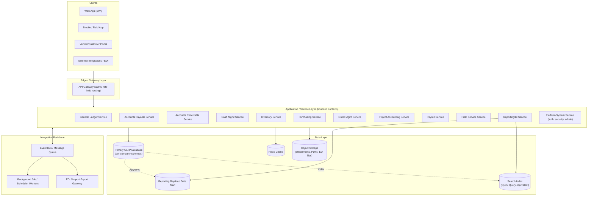

# Architecture Specification
## Modern Project-Centric ERP — Technical Architecture

**Document version:** 1.0
**Depends on:** `spec.md` (functional requirements/module map)
**Feeds:** `todo.md` (backend build plan), `frontend.md` (client build plan)

---

## 1. Architectural Goals

1. Replace the legacy two-tier "fat VB client + SQL Server" model with a **modern layered/API-first architecture** that is accessible from web and mobile, without losing the legacy's core strengths: fast grid-based data entry, strict batch/posting control, and deep drill-back.
2. Preserve **modularity** — the legacy system's biggest technical strength was that each screen/process was an independently deployable unit with minimal coupling. This architecture mirrors that with **bounded-context services/modules**, so any one module (AP, Inventory, Project Accounting, ...) can be developed, tested, and scaled independently.
3. Make the **General Ledger posting contract** the single most stable interface in the system, since (per `spec.md` §8) every module ultimately produces GL postings.
4. Design for **multi-company, multi-currency** from day one rather than retrofitting later.
5. Avoid the legacy limitation of "no real business-rule/API tier" — introduce a proper application/service layer so business rules are enforced once, centrally, not duplicated per client.

---

## 2. High-Level Architecture



### Layer summary
- **Clients:** thin, stateless UIs; all business logic lives server-side (unlike the legacy VB client, which embedded logic per screen executable).
- **API Gateway:** single entry point — authentication (OIDC), authorization pre-check, rate limiting, request routing, API versioning.
- **Application/Service Layer:** one deployable module per bounded context from `spec.md` §4–5. Can start as a **modular monolith** (single deployable, module boundaries enforced in code) and be split into independently deployed services later — see §9 (Evolution Path).
- **Integration Backbone:** async event bus decouples modules (e.g., "InventoryReceived" event triggers AP 3-way-match eligibility without AP calling Inventory synchronously); background workers handle batch/long-running processes (payroll runs, period close, report generation) — the modern equivalent of the legacy "Process Server" / "Application Server" off-load model.
- **Data Layer:** one OLTP system of record; a separate reporting store/replica so heavy report/BI queries never contend with transactional data-entry performance (a real gap in the legacy architecture, which queried the live OLTP database directly for both).

---

## 3. Technology Stack (recommended)

> Chosen for team productivity, strong typing (financial software benefits enormously from compile-time safety), first-class ORM/migration tooling, and mainstream long-term support. Alternatives are noted where a reasonable substitution exists.

| Concern | Recommendation | Why |
|---|---|---|
| Backend language/framework | **.NET 8 / C# with ASP.NET Core Web API** (alt: Node.js + NestJS/TypeScript) | Strong typing for money/decimal handling, mature ORM (EF Core), excellent for teams migrating off a Microsoft-stack legacy product, first-class Azure AD integration. |
| Database | **PostgreSQL** (alt: SQL Server, if organizational familiarity from the legacy product is a priority) | Open-source, strong window-function/CTE support for financial reporting queries, native JSONB for extensible/custom-field data. |
| ORM/Migrations | EF Core (or Prisma/TypeORM if Node.js chosen) | Versioned schema migrations are essential for a financial system's audit posture. |
| Auth/Identity | **OpenID Connect** via Azure Entra ID / Auth0 / Keycloak | SSO, MFA, and role/claims mapping into the app's RBAC model. |
| API style | REST (OpenAPI-documented) for CRUD/transactional endpoints; **GraphQL** optional for the BI/reporting layer where flexible field selection helps | Matches integration expectations of modern middleware/EDI partners. |
| Messaging/Events | **RabbitMQ** or cloud-native (Azure Service Bus / AWS SQS+SNS) | Reliable async processing for postings, notifications, and cross-module events. |
| Background jobs | **Hangfire** (.NET) or **BullMQ** (Node) | Replaces the legacy "Process Server" concept — scheduled/queued long-running jobs (payroll run, period close, batch report generation). |
| Caching | **Redis** | Session cache, lookup/combo data (vendors, customers, items) for fast UI typeahead. |
| Reporting/BI | Internal report engine (parameterized SQL + templating to PDF/Excel) + optional embed of **Power BI Embedded** or **Metabase** for dashboards | Mirrors the legacy Crystal Reports + Management Reporter + SSRS combination, modernized. |
| Search | **OpenSearch/Elasticsearch** for ad hoc "Quick Query" style search across transactions | Legacy "Quick Query Viewer/Editor" equivalent, at web scale. |
| File/Object Storage | **S3-compatible object storage** (AWS S3, Azure Blob) | Attachments, generated PDFs, inbound/outbound EDI files. |
| Containerization | **Docker** + **Kubernetes** (or a managed container platform) | Independent scaling of modules; consistent environments dev→prod. |
| CI/CD | **GitHub Actions** (or Azure DevOps) with automated test gates | Financial software needs strong automated regression coverage before merge. |
| Observability | **OpenTelemetry** + Grafana/Prometheus (or Azure Monitor/Application Insights) | Distributed tracing across the module boundaries introduced by this architecture. |
| IaC | **Terraform** or Bicep | Reproducible environments; disaster-recovery readiness. |

---

## 4. Module (Bounded Context) Boundaries

Directly follows `spec.md` §5. Each context owns its own tables and exposes a versioned API; cross-context reads happen via API calls or subscribed events — **never** direct cross-schema SQL joins in application code (this is the discipline the legacy system lacked, since everything lived in one database with ad hoc cross-module views).

| Bounded Context | Owns | Publishes events | Subscribes to events |
|---|---|---|---|
| Platform/System | Company, Period, Segment, User, Role, Audit Log | `PeriodClosed`, `UserProvisioned` | — |
| General Ledger | Account, Journal Batch/Entry, Budget | `BatchPosted`, `PeriodLocked` | `*PostingRequested` from every sub-ledger |
| Accounts Payable | Vendor, Voucher, Payment | `VoucherPosted`, `PaymentIssued` | `GoodsReceived`, `ProjectCostApproved` |
| Accounts Receivable | Customer, Invoice, Cash Receipt | `InvoicePosted`, `CashApplied` | `ShipmentConfirmed`, `ProjectInvoiceGenerated` |
| Cash Management | Bank Account, Reconciliation | `BankReconciled` | `PaymentIssued`, `CashApplied` |
| Inventory | Item, Warehouse, Inventory Transaction | `GoodsReceived`, `ItemIssued` | `POLineReceived`, `ShipmentRequested` |
| Purchasing | Requisition, PO | `PORequisitioned`, `POApproved` | `InventoryLevelLow` |
| Order Management | Sales Order, Shipment | `ShipmentConfirmed` | `InventoryAvailable`, `CreditApproved` |
| Project Accounting | Project, Task, Budget, Billing Schedule | `ProjectCostPosted`, `ProjectInvoiceGenerated` | `VoucherPosted`, `TimesheetApproved`, `ItemIssued` |
| Payroll | Employee, Timesheet, Payroll Run | `PayrollPosted`, `TimesheetApproved` | — |
| Field Service | Work Order, Dispatch | `WorkOrderCompleted` | `ItemIssued` |
| Reporting/BI | Report Definition, Dashboard | — | (reads from replica, all events for materialized views) |

---

## 5. Data Architecture

### 5.1 Canonical posting event
Every module that affects the GL emits a normalized posting message so the GL service (and the reporting replica) can consume a single, stable shape regardless of source module:

```json
{
  "sourceModule": "AP",
  "sourceDocumentId": "VCH-2026-000123",
  "companyId": "C001",
  "fiscalPeriod": "2026-07",
  "postingDate": "2026-07-29",
  "lines": [
    { "account": "2000", "segments": {"dept": "10", "project": "P-4501"}, "debit": 0, "credit": 550.00, "currency": "USD" },
    { "account": "6100", "segments": {"dept": "10", "project": "P-4501"}, "debit": 550.00, "credit": 0, "currency": "USD" }
  ],
  "metadata": { "vendorId": "V-1002", "postedBy": "u.jsmith", "correlationId": "..." }
}
```
This directly implements the "GLPostingReference" contract described in `spec.md` §8 and is the most important schema in the platform — treat changes to it as a breaking-change class requiring a version bump.

### 5.2 Multi-tenancy / multi-company
- Recommended model: **shared database, company-scoped rows** (a `company_id` column + row-level security) for small/medium deployments; **schema-per-company** as an option for large enterprise customers needing stronger isolation.
- All primary keys are globally unique (UUID or Snowflake ID) so cross-company/consolidated reporting doesn't require key remapping.

### 5.3 Chart of accounts / segments
- Model as a **generic segment table** (segment type, segment value, description, active flag) plus a **validated-combination table**, replicating the legacy "Flexkey" validation control described in `spec.md` §5.1 — this prevents "invalid account string" errors at the database layer instead of relying on UI-only validation.

### 5.4 Auditability
- Append-only `audit_log` table (or event-sourced ledger for GL/AP/AR specifically) capturing actor, timestamp, before/after state, and correlation ID.
- Posted financial records are **never hard-deleted or mutated**; corrections are modeled as new reversing/adjusting transactions, per `spec.md` §2.3.

### 5.5 Reporting store
- Change-data-capture (CDC) or scheduled ETL replicates OLTP data into a denormalized reporting schema/data mart, isolating BI query load from transactional performance — directly addressing a real architectural gap in the legacy single-database design.

---

## 6. Security Architecture

- **AuthN:** OIDC/SAML SSO; MFA enforced for admin and finance roles.
- **AuthZ:** RBAC with claims mapped to (a) module access, (b) action (view/create/edit/post/void/approve), and (c) field-level restrictions on sensitive data (e.g., payroll compensation fields) — matching the legacy system's per-screen/per-field security model, but enforced centrally in the API layer, not per client executable.
- **Segregation of duties:** configurable rule engine to prevent the same user from, e.g., creating and approving the same voucher above a threshold.
- **Encryption:** TLS in transit; encryption at rest for the database and object storage; field-level encryption for bank account numbers and SSNs.
- **API security:** short-lived JWTs, scoped API keys for machine/integration clients, per-client rate limits.
- **Secrets management:** centralized vault (Azure Key Vault / HashiCorp Vault) — no secrets in config files or source control.

---

## 7. Integration Architecture

- **REST API** (OpenAPI 3.1 documented) as the default integration surface for every module in `spec.md` §5.
- **Webhooks** for key lifecycle events (`VoucherPosted`, `InvoicePosted`, `POApproved`, `PayrollPosted`, ...) so external systems (banking, tax filing, CRM) can react without polling.
- **EDI Gateway** module translating X12/EDIFACT documents (850 PO, 810 Invoice, 856 ASN, etc.) to/from the internal API — the modern equivalent of the legacy "eCommerce Gateway — EDI Edition."
- **Bulk import/export** (CSV/Excel) with a validation-preview step before commit, mirroring the legacy's screen-level import tools but centralized as a platform service usable by any module.
- **CRM integration boundary**: a documented, versioned API contract (customer/opportunity sync) rather than a native CRM module, per `spec.md` §2.2 scope decision.

---

## 8. Deployment Architecture

- **Environments:** dev → test/QA → staging → production, each with isolated databases and infra, provisioned via Terraform/Bicep.
- **Containers:** each bounded-context service (or the modular monolith initially) packaged as a container image; orchestrated via Kubernetes (or a managed PaaS like Azure Container Apps / AWS ECS for smaller teams).
- **CI/CD pipeline stages:** build → unit tests → static analysis/security scan → integration tests (spin up ephemeral DB) → deploy to staging → automated smoke tests → manual approval gate → deploy to production → post-deploy health checks.
- **Database migrations:** applied via a controlled pipeline step with rollback scripts; financial schema changes require an additional peer-review gate given audit sensitivity.
- **Blue/green or canary deploys** for the API layer to avoid downtime during business hours (a real operational improvement over legacy on-prem "apply patch, restart terminal server" upgrades).

---

## 9. Evolution Path (Modular Monolith → Services)

1. **Phase 1:** Build as a **modular monolith** — one deployable, but with strict module boundaries (separate namespaces/projects, one owning schema per module, internal calls only through defined module interfaces, no cross-module SQL joins). This gets a working system to market fastest while preserving the option to split later, and matches the legacy system's "many small, loosely coupled executables" philosophy without its lack of a shared business-rule tier.
2. **Phase 2:** Extract high-load or independently-scaled contexts (typically **Reporting/BI**, **Inventory**, and **Project Accounting**, which have the heaviest read/compute profiles) into separately deployed services communicating over the event bus and REST APIs already defined in Phase 1.
3. **Phase 3:** Full bounded-context service mesh if scale requires it, with the event schema from §5.1 already proven stable enough to support independent deployment cadences per module.

---

## 10. Observability & Operations

- **Structured logging** (JSON) with correlation IDs threaded from the API gateway through every downstream call and background job.
- **Distributed tracing** (OpenTelemetry) across module boundaries — critical once Phase 2/3 of §9 splits services out.
- **Metrics/dashboards:** batch posting latency, period-close duration, API error rates, queue depth for background jobs.
- **Alerting:** failed postings, reconciliation variances, failed payroll runs, integration/EDI errors routed to an on-call channel.
- **Disaster recovery:** automated backups with point-in-time restore for the OLTP database; documented RTO/RPO targets; periodic restore drills.

---

## 11. Migration & Data Conversion Strategy (from a legacy Dynamics SL instance, if applicable)

1. **Inventory the legacy schema** (screen-by-screen, using the `module.screen.version` convention noted in `spec.md` §1.2) and map each legacy table to a target entity in the new data model.
2. **Master data first:** Chart of accounts/segments, vendors, customers, items, employees, projects — validate referential integrity before touching transactional history.
3. **Open transactional data next:** unposted batches, open AP vouchers, open AR invoices, open POs, in-progress projects with WIP balances.
4. **Historical/closed data last (optional):** either migrate full history or keep the legacy system in a read-only "archive" mode and provide a reporting bridge — a common, cost-effective pattern for ERP replacements.
5. **Parallel run / reconciliation period:** run both systems for at least one full period, comparing trial balances and sub-ledger control totals before cutover, directly mirroring the legacy system's own year-end tie-out discipline (`spec.md` §6.4).
6. **Cutover:** freeze legacy system, final delta migration, go-live on the new system with the legacy system retained read-only for audit/history reference.
